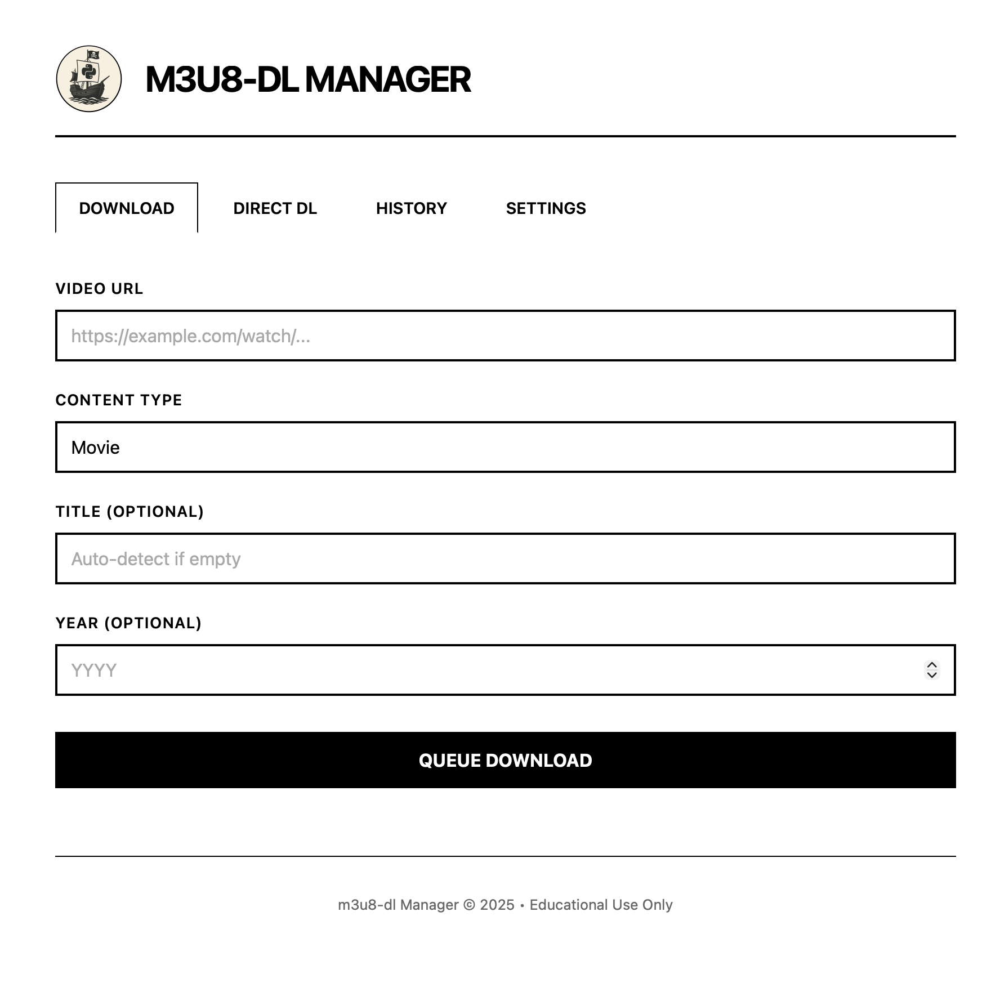

<div align="center">


# M3U8 Downloader

**Professional HLS Stream Downloader for Educational Research**

[](https://www.python.org/downloads/)
[](#legal-notice)

[Features](#features) • [Quick Start](#quick-start) • [Usage](#usage) • [Radarr](#radarr-integration) • [Sonarr](#sonarr-integration) • [Docker](#docker)

</div>

---

## Legal Notice

> **FOR EDUCATIONAL AND RESEARCH PURPOSES ONLY**
>
> This software is provided as-is for academic research and educational purposes. Users are solely responsible for compliance with copyright laws and terms of service. The authors accept no liability for misuse. Unauthorized downloading of copyrighted content is illegal in most jurisdictions.

---

## Features

### HLS Downloader

- **Automated Stream Capture** - Intercepts HLS streams with authentication tokens
- **Smart Metadata Extraction** - Generates proper filenames from API metadata
- **Resilient Fallback System** - Tries multiple mirrors and stream variants automatically
- **Docker Ready** - Pre-configured container with all dependencies
- **Dual Interface** - Use as CLI tool, Python library, or Web Server
- **Optimized Performance** - Concurrent mirror scanning and intelligent retry logic

### Radarr Integration

- **Automatic TMDB Lookup** - Searches and matches movies automatically
- **Library Integration** - Seamlessly adds movies to your Radarr library
- **Smart Filename Parsing** - Extracts title and year from filenames
- **Organized Import** - Properly structures files in Radarr's format
- **Flexible Configuration** - Supports custom quality profiles and root folders

### Sonarr Integration

- **Automatic TVDB Lookup** - Searches and matches TV series automatically
- **Library Integration** - Seamlessly adds shows to your Sonarr library
- **Smart Episode Parsing** - Extracts series/season/episode from filenames
- **Season Organization** - Properly structures episodes in season folders
- **Flexible Configuration** - Supports custom quality profiles and root folders

## Quick Start

### Local Installation

```bash
# Install dependencies
pip install -r requirements.txt

# Install browser (required for patchright)
patchright install chromium

# Run the server
python -m m3u8_dl.server
```

### Docker

```bash
# Build image
docker build -t m3u8-dl .

# Run container
docker run -p 8000:8000 -v $(pwd)/downloads:/app/downloads --env-file .env m3u8-dl
```

## Usage

### Web Interface

The easiest way to use the tool is via the Web UI.



1. Start the server: `python -m m3u8_dl.server`
2. Open `http://localhost:8000`
3. Enter the video URL and select the type (Movie or Series)
4. The tool will download the video and automatically import it to Radarr/Sonarr

### Command Line Interface

**Basic download:**
```bash
python -m m3u8_dl https://example.com/watch/1590407
```

**With custom filename:**
```bash
python -m m3u8_dl https://example.com/watch/1590407 --name my_video
```

**Save to specific directory:**
```bash
python -m m3u8_dl https://example.com/watch/1590407 -o ~/Downloads
```

### Python Library

```python
import asyncio
from m3u8_dl import download_video

async def main():
    await download_video("https://example.com/watch/1590407")
    
asyncio.run(main())
```

## Radarr Integration

Upload and automatically import downloaded movies into Radarr with proper metadata.

### Setup

Set your environment variables in `.env` or export them:
```bash
export RADARR_URL=http://localhost:7878
export RADARR_API_KEY=your_api_key_here
```

### CLI Usage

**Auto-detect title and year from filename:**
```bash
python -m m3u8_dl.radarr_cli "The Matrix 1999.mp4"
```

**Specify title and year manually:**
```bash
python -m m3u8_dl.radarr_cli movie.mp4 --title "The Matrix" --year 1999
```

## Sonarr Integration

Upload and automatically import downloaded TV episodes into Sonarr with proper metadata.

### Setup

Set your environment variables in `.env` or export them:
```bash
export SONARR_URL=http://localhost:8989
export SONARR_API_KEY=your_api_key_here
```

### CLI Usage

**Auto-detect from filename:**
```bash
python -m m3u8_dl.sonarr_cli "Breaking.Bad.S01E01.mp4"
```

**Specify series, season, and episode manually:**
```bash
python -m m3u8_dl.sonarr_cli episode.mp4 --title "Breaking Bad" --season 1 --episode 1
```

## How It Works

1. **Browser Automation** - Launches headless Chrome via patchright to execute JavaScript
2. **Network Interception** - Captures authenticated .m3u8 HLS stream URLs
3. **Metadata Extraction** - Parses API responses for title, season, episode information
4. **Intelligent Fallback** - Tries multiple mirrors and stream variants on failure
5. **Stream Download** - Downloads via yt-dlp with proper authentication tokens

## Troubleshooting

| Issue | Solution |
|-------|----------|
| Browser not found | Install Chrome or use Docker |
| No streams found | Video may be unavailable or region-locked |
| Download fails (502) | Tool automatically retries with alternative mirrors |
| yt-dlp errors | Update: `pip install -U yt-dlp` |

---

<div align="center">

### Legal Disclaimer

**This software is provided "AS IS" without warranty of any kind.**

Users are solely responsible for compliance with all applicable laws, including but not limited to copyright laws, terms of service agreements, and data protection regulations. The authors and contributors accept no liability for misuse, legal consequences, or damages arising from the use of this software.

**Unauthorized downloading of copyrighted content is illegal.**

Use at your own risk and responsibility.

---

Made for educational purposes

</div>
